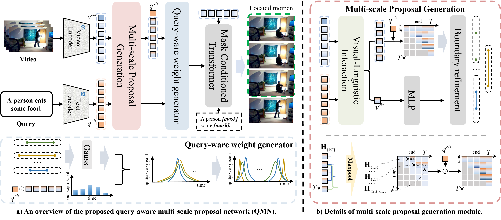

# Query-aware Multi-scale Proposal Network for Weakly Supervised Temporal Sentence Grounding in Videos  
This repository contains the code and resources for the paper:  
"Query-aware Multi-scale Proposal Network for Weakly Supervised Temporal Sentence Grounding in Videos" (Knowledge-Based Systems, 2024).  

  

## Table of Contents  
- [Overview](#overview)  
- [Data Preparation](#data-preparation)  
- [Environment Setup](#environment-setup)  
- [Running Experiments](#running-experiments)  
- [Citation](#citation)  

---

## Overview  
This project introduces a novel Query-aware Multi-scale Proposal Network, designed for weakly supervised temporal sentence grounding in videos. The model effectively leverages query-aware multi-scale proposals to improve temporal grounding accuracy under weak supervision.  

For a visual overview of the model, see `imgs/method.png`. 

### Performance Comparison on the Charades-STA Test Set

The table below presents the performance comparison on the Charades-STA test set. R@𝑛 represents the recall evaluation result of the time series timestamps of the first 𝑛 predictions. Bold indicates optimal performance, and underline indicates suboptimal performance. Methods using additional annotations or large-scale pre-trained models are marked with †.

| Method   | R@1, IoU=0.3 | R@1, IoU=0.5 | R@1, IoU=0.7    | R@5, IoU=0.3 | R@5, IoU=0.5 | R@5, IoU=0.7    |
|----------|---------|--------|---------|--------|----------|--------|
| TGA | 32.14  | 19.94  |  8.84   | 86.58  | 65.52  | 33.51   |
| WSRA | 50.13  | 31.20  | 11.01   | 86.75  | 70.50  | 39.02   |
| CCL   | -      | 33.21  | 15.68   | -      | 73.50  | 41.87   |
| VCA  | 58.58  | 38.13  | 19.57   | **98.08** | 78.75  | 37.75   |
| LCNet | 59.60 | 39.19  | 18.87   | 94.78  | 80.56  | 45.24   |
| RTBPN | 60.04 | 32.36  | 13.24   | 97.48  | 71.85  | 41.18   |
| CVTRN | 64.88 | 39.42  | 17.80   | -      | -      | -       |
| CNM  | 60.39  | 35.43  | 15.45   | -      | -      | -       |
| CPL  | 65.99  | 49.05  | 22.61   | 96.99  | 84.71  | 52.37   |
| CCR | 68.59  | 50.79  | 23.75   | 96.85  | 84.48  | 52.44   |
| CCR*  | 69.25  | 48.67  | 21.41   | 97.59  | 84.42  | 50.73   |
| CRM† | 53.66  | 34.76  | 16.37   | -      | -      | -       |
| IRON† | 70.71 | 51.84  | 25.01   | 98.96  | 86.80  | 54.99   |
| SCANet† | 68.04 | 50.85  | 24.07   | 98.24  | 86.32  | 53.28   |
| QMN      | **69.35** | **52.66** | **25.17** | **97.91** | **89.65** | **54.37** |

**Notes:**
- Bold values represent the best performance in each column.
- Methods marked with † utilize additional annotations or large-scale pre-trained models.


---

## Data Preparation  
If any dataset link becomes invalid, you can refer to [Hugging Face](https://huggingface.co/Lonicerin) for alternative resources.
### Charades-STA and ActivityNet Captions  
- **Charades-STA Features**: Use the features provided by [LGI](https://github.com/JonghwanMun/LGI4temporalgrounding). See the [Charades-STA repository](https://github.com/JonghwanMun/LGI4temporalgrounding) for details.  
- **ActivityNet Captions Features**: Download hdf5 features from [ActivityNet Captions](http://activity-net.org/challenges/2016/download.html).  

Download the features and place them in the corresponding directories under `data/`.  
Refer to [CPL](https://github.com/minghangz/cpl) for additional details on feature preparation.  

### TACoS and EgoVLP  
- **TACoS Features**: Contact the first author via email to obtain the feature files.  
- **EgoVLP Features**: Similarly, contact the first author for access to these features.  

### Important Note  
Ensure you modify the `config` JSON files to set the correct `feature_path` for each dataset.  

---

## Environment Setup  
Follow the environment setup instructions in: **CPL: Weakly Supervised Temporal Sentence Grounding with Gaussian-based Contrastive Proposal Learning** [CPL](https://github.com/minghangz/cpl) .
This will guide you in preparing the required dependencies and configurations.  

---

## Running Experiments
To conduct experiments on the four datasets (Charades-STA, ActivityNet Captions, TACoS, and EgoVLP), execute the corresponding bash scripts provided in the repository.  
Before running the test, please create a new folder for the error path to store the results.

---

## Citation  
If you find this work helpful in your research, please consider citing:  

```bibtex  
@article{zhou2024query,  
  title={Query-aware multi-scale proposal network for weakly supervised temporal sentence grounding in videos},  
  author={Zhou, Mingyao and Chen, Wenjing and Sun, Hao and Xie, Wei and Dong, Ming and Lu, Xiaoqiang},  
  journal={Knowledge-Based Systems},  
  volume={304},  
  pages={112592},  
  year={2024},  
  publisher={Elsevier}  
}  
```  

---  
For additional inquiries or support, feel free to contact the first author via email.  
